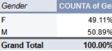
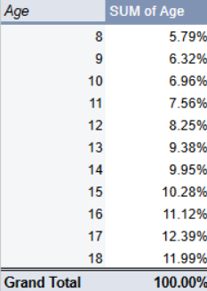
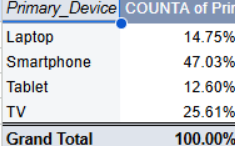
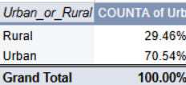
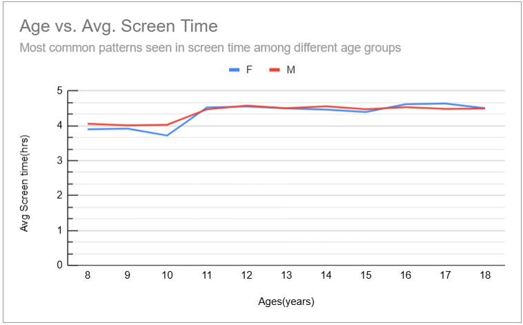
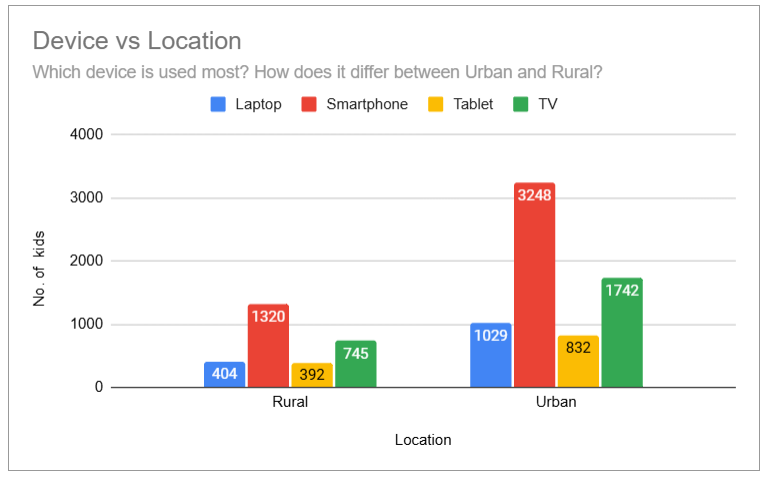
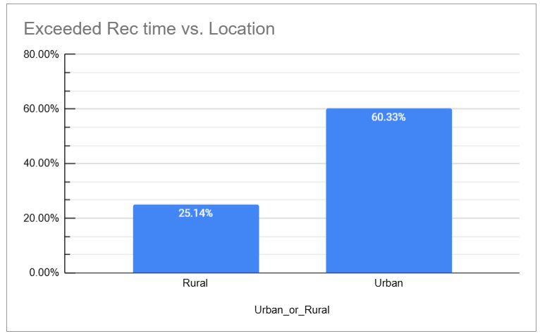
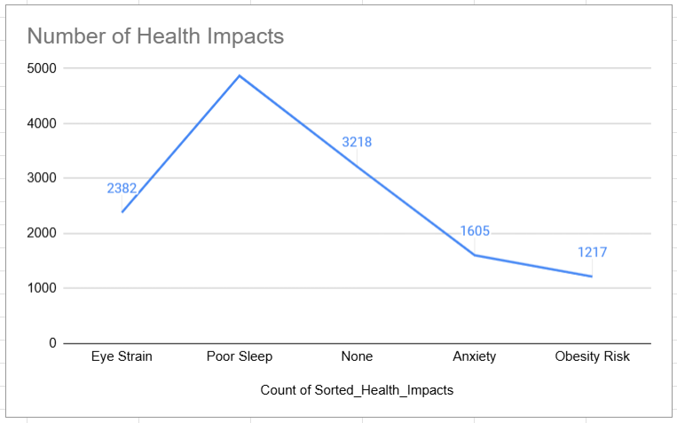

# Indian Kids Screen Time Analysis Report (Post-COVID, 2023–2024)

---

## 1. Problem Definition

The COVID-19 pandemic drastically changed children's lifestyles worldwide. In India, lockdowns and remote schooling significantly increased screen exposure among children aged 8 to 18 years. Prolonged screen time is linked to physical and mental health issues such as poor sleep, eye strain, anxiety, and obesity.

This project analyzes data collected in 2023–2024 to understand current screen time patterns among Indian children post-pandemic. The aim is to identify trends by age and gender; examine device usage; assess adherence to screen time guidelines; and explore associated health outcomes.

### Key Research Questions

- What are the screen time patterns across different ages and genders?  
- Which devices are most commonly used in urban vs. rural settings? How does it differ between urban and rural?  
- What percentage of children exceed the Indian Academy of Paediatrics (IAP) screen time guidelines?  
- What are the most common health impacts reported?

---

## 2. Data Collection & Description

This project uses a dataset sourced from [Kaggle: Indian Kids Screen Time 2025](https://www.kaggle.com/datasets/ankushpanday2/indian-kids-screentime-2025). The dataset simulates screen time patterns of 9,712 Indian children aged 8 to 18 years, built using real-world trends and scientific studies conducted in India between 2023 and 2024. It combines urban and rural demographics, reflecting differences in device access, screen habits, and health outcomes.

### Key Dataset Features:

- Age and gender  
- Primary screen device (smartphone, TV, tablet, laptop)  
- Time split between educational and recreational use  
- Whether screen time exceeds Indian Academy of Pediatrics (IAP) guidelines  
- Reported health impacts including poor sleep, eye strain, anxiety, and obesity risk  

---

## 3. Data Cleaning & Bias Checking

### Data Cleaning

- **Trimmed Whitespace:** Removed any extra spaces from all text fields to ensure consistency.  
- **Standardization:**  
  - Converted gender entries like "Male" to "M".  
  - Standardized device names, e.g., changed "smart phone" to "Smartphone".  
- **Sorted Data:** Organized the dataset by age for easier analysis.  
- **Checked for Missing Values:**  
  - If an important value was missing in a row, that row was deleted.  
  - If the missing value was not critical, it was marked as "N/A" and retained.  
- **Duplicates Check:**  
  - Verified duplicates based on all columns and found none (0 duplicates).  
- **Validated Data:** Checked for impossible or invalid values and corrected or removed them.

### Bias Handling

#### Gender ratio (Male vs Female)

#### Age distribution

#### Device types

#### Urban vs Rural location 

- Moderate location bias (Urban 70%, Rural 30%) found.  
- Instead of down/up-sampling (which causes data loss), used **weights** to adjust:  
  - Weight formula:  
    `=IF(TRIM(G2)="Urban", 0.714, IF(TRIM(G2)="Rural", 1.67, 1))`  
  - Weighted screen time:  
    `=D3 * J3`  
  - Overall weighted screen time:  
    `=SUM(K2:K9713) / SUM(J2:J9713)`  

---

## 4. Data Analysis & Findings

### 4.1 Most Common Patterns in Screen Time by Age and Gender

- The weighted average daily screen time for children aged 8 to 18 is well above the Indian Academy of Pediatrics (IAP) recommended limit of 2 hours per day.  
- Screen time ranges from approximately 3.7 hours per day for 8-year-olds to over 4.6 hours for older teens.  
- Screen time generally increases steadily with age, peaking in late adolescence.  
- Males spend slightly more time on screens compared to females, though the difference is minimal (typically less than 0.15 hours).  
- The data indicates consistent overuse of screens across all age and gender groups.

  

### 4.2 Device Usage Across Urban and Rural Locations

- Smartphones are the most commonly used primary device, with 3,248 urban users (about 47% of urban children) and 1,320 rural users (around 30% of rural children).  
- Urban children use all device types more frequently than rural children, with the largest gap seen in smartphone usage (urban children use smartphones about 2.5 times more than rural children).  
- TVs are the second most popular device in both urban and rural settings, but their usage is significantly less than smartphones.  
- Laptops and tablets have relatively low usage overall, with urban children showing higher counts than rural peers.

    

### 4.3 Percentage Exceeding IAP Recommended Screen Time

- An alarming 85.49% of children exceed the recommended screen time limits set by the IAP.  
- Urban children are more likely to exceed these limits (60.33%) compared to rural children (25.14%).  
- This widespread overuse suggests an urgent need for public health interventions and awareness campaigns tailored to different demographic groups.

  
  
### 4.4 Most Common Health Issues Reported

- Analysed health impacts reported by children related to screen time.  
- The most prevalent issues are:  
  - **Poor Sleep:** Reported by approximately 50% of children.  
  - **Eye Strain:** Experienced by about 25%.  
  - **Anxiety:** Reported by roughly 17%.  
  - **Obesity Risk:** Noted in around 13%.  
- About 33% of children report no health impacts related to screen use.  
- Many children experience multiple overlapping issues.  
- Children exceeding recommended screen time limits tend to have higher occurrences of these health concerns.

  
  
---

## 5. Insights

- **Screen time is consistently high across all age groups**, with an increasing trend from younger children (around 3.7 hours/day) to older teens (over 4.5 hours/day), well exceeding the IAP’s recommended 2-hour limit.  
- **Males tend to have slightly higher screen time than females**, but the difference is minimal, indicating similar usage habits across genders.  
- **Smartphones dominate as the primary screen device**, especially in urban areas where usage is roughly 2.5 times higher than in rural settings. Rural children show greater reliance on TVs and tablets.  
- **A vast majority (85.5%) of children exceed recommended screen time limits**, with urban children more likely to surpass guidelines than rural peers.  
- **Common health issues linked to high screen time include poor sleep (50%), eye strain (25%), anxiety (17%), and obesity risk (13%)**. A significant portion (33%) of children report no health impacts, but multiple overlapping health concerns are frequent among those exceeding screen time recommendations.  

## 6. Conclusion

The post-COVID landscape has amplified screen time among Indian children, raising concerns about their physical and mental well-being. Excessive screen exposure is widespread, crossing demographic lines of age, gender, and location. Urban children not only spend more time on screens but also predominantly use smartphones, reflecting greater device accessibility.

These elevated screen habits correlate strongly with health challenges such as poor sleep and eye strain, underscoring the urgent need for awareness campaigns and parental guidance. Policy interventions tailored to both urban and rural contexts can help mitigate risks and encourage healthier screen habits among children.

This analysis highlights the importance of balanced screen usage and calls for multi-level efforts involving families, schools, and policymakers to protect children’s health in an increasingly digital world.

---

## 7. Tools & Methods

- **Data Cleaning & Preparation:** Performed in **Google Sheets** using functions for trimming whitespace, standardization, handling missing values, and creating helper columns for grouping and weighting.  
- **Bias Adjustment:** Implemented a weighting scheme in the dataset to correct for urban-rural sampling imbalance, ensuring representative analysis.  
- **Data Analysis:** Conducted using **pivot tables** and calculated weighted averages to explore screen time patterns, device usage, and health impacts.  
- **Visualization:** Created charts (bar charts, column charts) within Google Sheets to illustrate key findings clearly.  
- **Reporting:** Compiled findings and insights into a markdown report with embedded visualizations for easy sharing on GitHub.  

---
## 8. References & Sources

- Dataset: [Indian Kids Screen Time 2025 - Kaggle](https://www.kaggle.com/datasets/ankushpanday2/indian-kids-screentime-2025)  
- Indian Academy of Pediatrics (IAP) Screen Time Guidelines   
- WHO recommendations on children’s screen time  

---

## 9. Contact Information

- Email: dnanduri1910@gmail.com 
- GitHub: [github.com/divyans1910/](https://github.com/divyans1910/)  
- LinkedIn: [linkedin.com/in/nanduridivya](www.linkedin.com/in/nanduridivya)

---

Thank you for reviewing my analysis!  
Please feel free to reach out with any questions or feedback.
